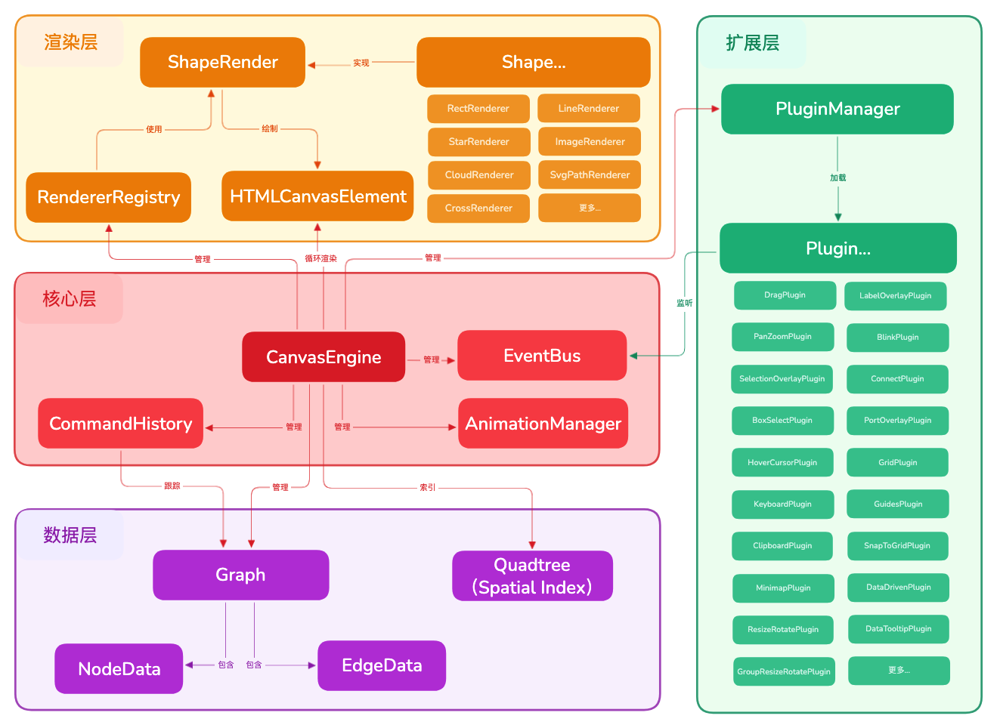
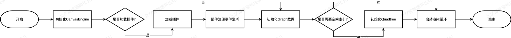

# 架构概览

AgileJS Core 采用模块化、分层设计，旨在提供高性能、可扩展的 Canvas 图形编辑能力。核心架构围绕 `CanvasEngine` 展开，将数据模型、渲染管线、交互逻辑和插件系统解耦。

## 核心架构图

## 核心模块详解

### 1. CanvasEngine (引擎核心)
`CanvasEngine` 是整个库的入口和控制器。它负责：
- **生命周期管理**：初始化 Canvas、启动渲染循环 (`tick`)、处理销毁。
- **资源协调**：持有并协调 Graph、Renderer、PluginManager 等子系统。
- **全局状态**：管理视口 (Viewport)、变换矩阵、交互模式 (Edit/View)。
- **性能优化**：集成空间索引 (Quadtree) 和渲染降级策略。

### 2. Model (数据模型)
`Graph` 类是数据源，负责存储和管理所有的节点 (`NodeData`) 和边 (`EdgeData`)。
- **纯数据驱动**：节点和边是纯 JSON 对象，易于序列化和传输。
- **版本控制**：维护 `structureVersion` 和 `renderVersion`，用于高效的变更检测和缓存失效。
- **空间索引**：通过 Quadtree 加速碰撞检测和视口剔除 (Culling)。

### 3. Renderer (渲染系统)
渲染层负责将数据模型绘制到 Canvas 上。
- **RendererRegistry**：管理不同形状的渲染器。
- **ShapeRenderer**：定义节点和边的具体绘制逻辑。支持自定义形状。
- **分层渲染**：支持背景、网格、连线、节点、覆盖层 (Overlay) 的分层绘制顺序。

### 4. Plugin System (插件系统)
AgileJS 采用微内核架构，绝大多数交互功能都通过插件实现。
- **PluginManager**：负责插件的注册、生命周期管理和 Hook 调用。
- **Plugin**：插件可以访问 Engine 实例，监听事件，甚至拦截渲染流程。
- **内置插件**：选择 (Selection)、拖拽 (Drag)、缩放 (PanZoom)、网格 (Grid) 等均为内置插件。

### 5. Event System (事件系统)
`EventBus` 实现了发布-订阅模式，用于模块解耦。
- **系统事件**：`engine:tick`, `engine:resize`, `graph:change` 等。
- **交互事件**：插件可以发射自定义事件，供业务层消费。

## 数据流向

1. **初始化**：创建 `CanvasEngine`，挂载 DOM。
2. **加载数据**：调用 `graph.addNode()` / `graph.addEdge()` 注入数据。
3. **渲染循环**：
    - `Engine` 触发 `tick`。
    - 清空 Canvas。
    - 计算可视区域 (Viewport)。
    - 查询 Quadtree 获取可视元素。
    - 调用 `Renderer` 绘制可视元素。
4. **交互**：
    - 用户操作 (鼠标/键盘) 触发 DOM 事件。
    - 插件捕获事件，修改 `Graph` 数据或 `Engine` 状态。
    - `Graph` 版本号更新。
    - 下一帧渲染循环响应变化。
