# 编辑器使用说明

## 整体布局

整个编辑器包含工具栏、图形面板、属性栏以及画布区四个部分。

<!-- 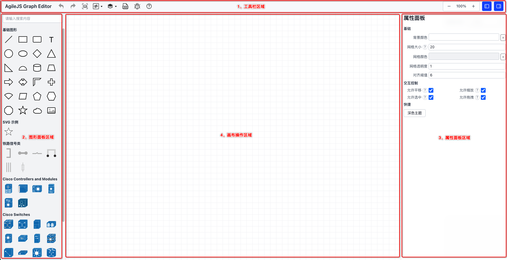 -->
<video controls autoplay muted loop playsinline width="100%">
  <source src="https://docs.cq-tct.com/funenc/agilejs/02.mp4" type="video/mp4" />
  您的浏览器不支持视频播放。
</video>

## 画布

:::info 提示

点击画布空白区域，展开属性面板即可控制画布属性。

:::

### 平移

点击画布空白处左键拖动。

### 缩放

缩放的区间为 10% ~ 1000%。

#### 方式1、通过鼠标混轮缩放

画布区域任意位置滚轮，以鼠标为中心进行缩放。

#### 方式2、通过比例尺缩放

点击“-”、“+”进行缩小和放大，步长为当前比例的10%，中间的比例数值为当前画布的缩放比例（点击它自动回到100%尺寸）。

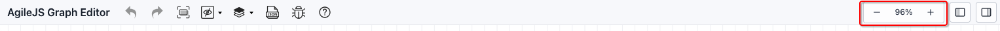

#### 方式3、自适应到全屏缩放

点击缩放到全屏按钮，当前面画布中的内容自动缩放到合适比例（内边距为20px）。

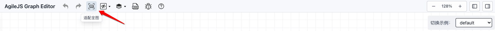

### 网格

可以对网格的尺寸、颜色、透明度控制。

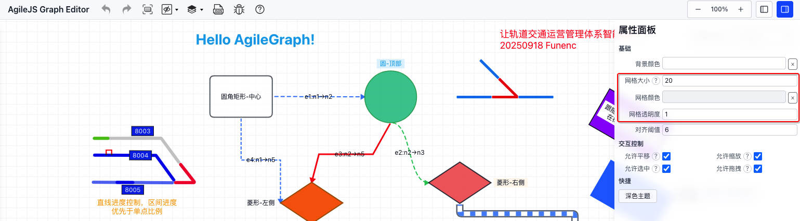

### 参考线

:::warning

对于画布放大（如：10%）情况下进行小尺寸位置调整建议用鼠标控制。

:::

默认吸附阈值为 `6px`，仅在每个轴选取一个"最小位移"的吸附候选，避免多次叠加。

### 主题

当前系统内置两套主题 `light`（默认）和 `dark`，若需自定义可自行在json文件的canvas内调整样式。

  
  

## 节点

### 选择

:::tip

前提条件：全局配置支持节点可选，并且节点本身运行可选。

:::

点击画布空白处可取消所有选择。

#### 方式1、单选

鼠标左键点击节点即可。

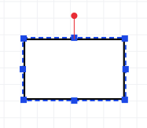

#### 方式2、多选

按住shift键，鼠标左键选择节点即可。

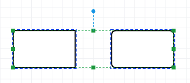

#### 方式3、框选

按住Cmd键，鼠标左键画布空白区域，拖动框选区域内节点即可（节点需完全在框选区域内）。

  
  

### 移动

按住待拖动节点进行拖动即可。按住shift键时，拖拽4个角控制点保持等比例缩放。

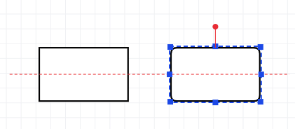

### 缩放

点击选择节点，拖拽外框控制点进行缩放。

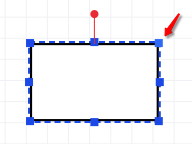

### 旋转

鼠标移到旋转句柄上，按住鼠标左键并转圈可对节点进行旋转。

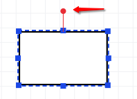

### 对齐

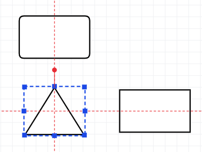

### 组合

:::tip

组合中的图形如何存在标签 `label`，鼠标点击该标签上即选中节点时，可以对其进行移动和尺寸改变，但这种情况是没有对齐线的。

:::

操作步骤：
 - 选择待组合的节点，可框选也可以多选（也可以选择已组合的节点进行再组合）；
 - 组合：Cmd/Ctrl+G；

  
  

### 解组

操作步骤：
 - 选择待解组的节点（如果涉及再组合的节点，将根据组合的顺序逆向逐层解组）；
 - 解组：Shift+Cmd/Ctrl+G；

  
  

### 容器

在普通节点上添加”允许容器“属性，将其他节点完全拖到其内即可，此时子节点会自动添加 `parentId` 属性。

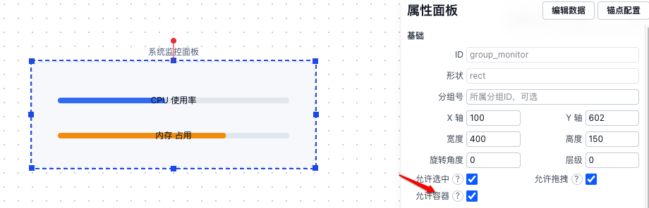

### 锚点

默认节点有4个锚点，鼠标移动到节点上即可显示，同时可以根据需要自定义锚点为何和数量，考虑到节点缩放变化大建议采用“相对偏移”模式。

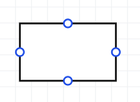
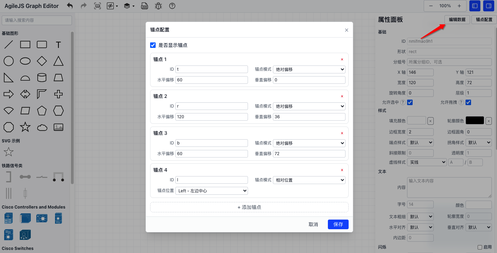

### 控制

选中图元节点后，可在右侧样式栏中，设置该节点的默认行为，同时在顶部工具栏可控制节点显示/隐藏、节点层级（置顶、置底、上移一层、下移一层）。

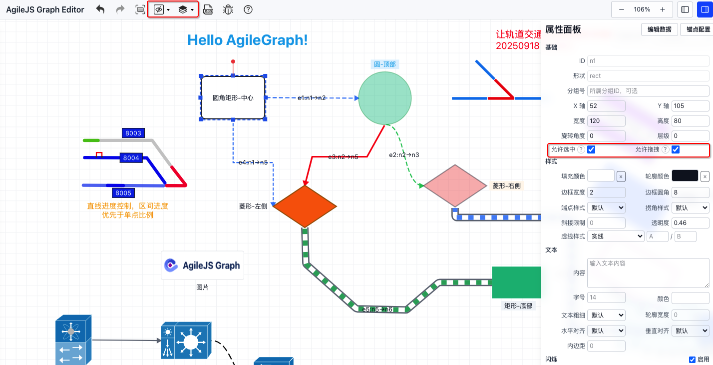

|  操作名称   | 说明  |
|  :----  | :----  |
| 可选中  | 该节点是否在画布中可选中，设置为不可选中后，可在节点列表上选中 |
| 可拖拽  | 该节点是否可移动 |

### 自定义数据

通常用于业务根据自身逻辑识别节点场景，采用 `key-value` 方式存储，值为字符串，如果节点已经存在自定义数据，鼠标在节点上停留即可查看自定义数据。

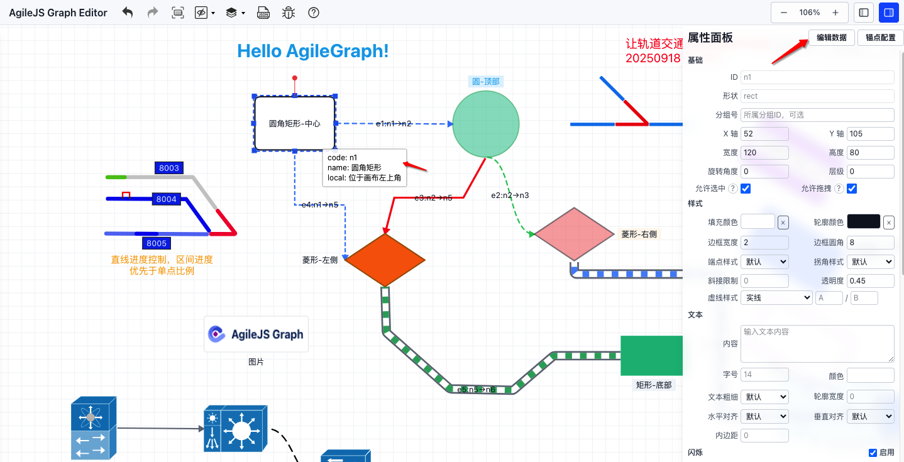
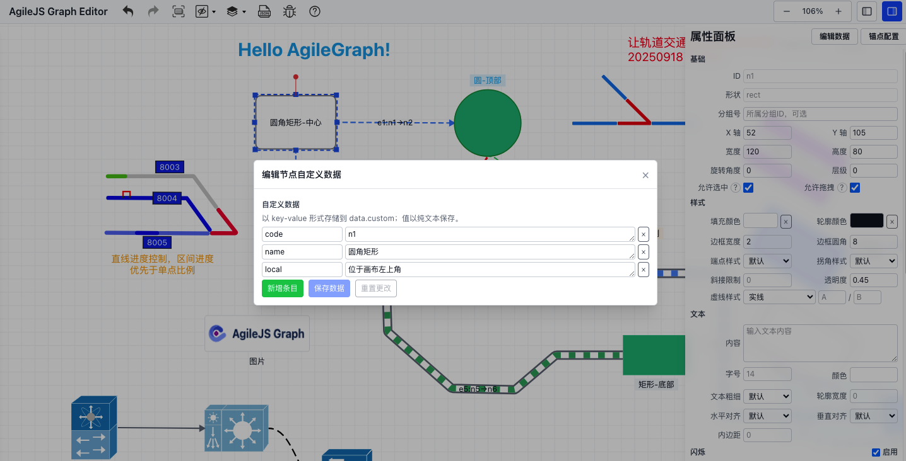

## 边

当前提供4类边（直线、正交直线、折线、贝塞尔曲线），点击边可在右侧属性面板进行属性配置。

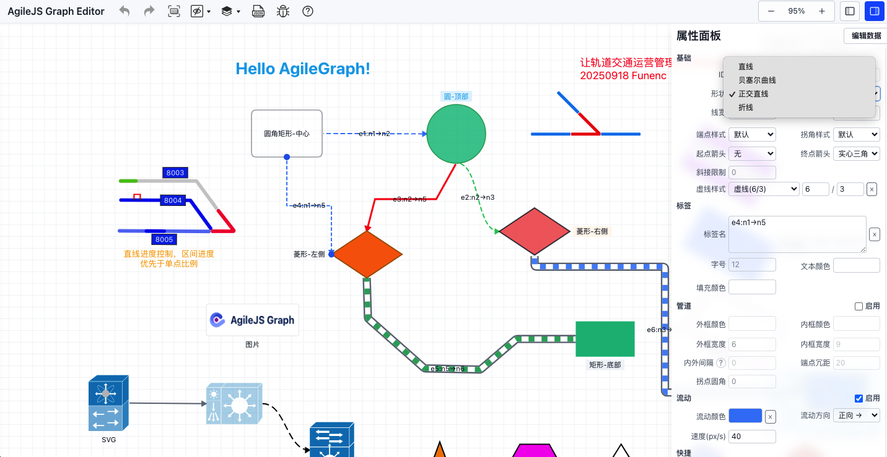

### 连接边

鼠标移到节点上锚点出现+时，按住鼠标左键拖动到其他节点的锚点上出现实心蓝色圆圈松开左键即可新建边。

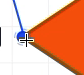

### 调整边

:::tip

如果多个边连接同一个锚点时，可选中一条边（出现调整弯箭头），鼠标靠近需要调整一侧按住左键拖拽即可。

:::

鼠标移动到边连接的锚点上出现调整箭头时，按住鼠标左键拖动到其他锚点上出现聚焦样式即可调整边。

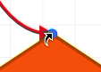

### 自定义数据

详见[节点自定义数据](#自定义数据)。

## 快捷键
- **常用快捷键**：
  - 画布：
    - `Ctrl + A`：全选；
    - `Ctrl + Z`：撤销；
    - `Ctrl + Y`：重做；
  - 节点：
    - `Ctrl + C`：复制；
    - `Ctrl + V`：粘贴；
    - `Delete`：删除选中元素；
    - `Cmd/Ctrl + G`：组合；
    - `Shift + Cmd/Ctrl + G`：解组；
    - 按住Shift调整尺寸：保持宽高比；
    - 按住Shift旋转：15度对齐；
    - 按住 Cmd/Ctrl + 左键在空白处拖拽（Shift 叠加选择）：框选；
  - 折线边：
    - `Alt/Shift + 点击线段`：插点，拖动蓝色方块移动拐点；
    - `Cmd/Ctrl + 点击拐点`：删除，点击或拖动端点重连到最近锚点，点击空白或其他元素可取消边控制；
  - 直线：
    - 按住Shift+点击线插点（不显示），拖动蓝色方块移动插点；
    - 按住Alt+点击拐点可删除；

## 高级用法

### 管道模式

- **功能描述**：支持数据流式操作，其中折线可动态添加多个拐点形成不同的线段。
- **应用场景**：适用于轻量组态管道等场景。

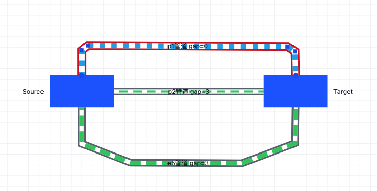

### Line 操作

:::tip

由于line可以随意改变拐点和端点位置，为了保持其移动平顺所以其尺寸、偏移位置等精确2位小数。

:::

- **功能描述**：可动态添加多个拐点形弯折的直线段，同时支持不同的底色进度控制（正向、反向、中间）。
- **应用场景**：适用于站场图等场景。

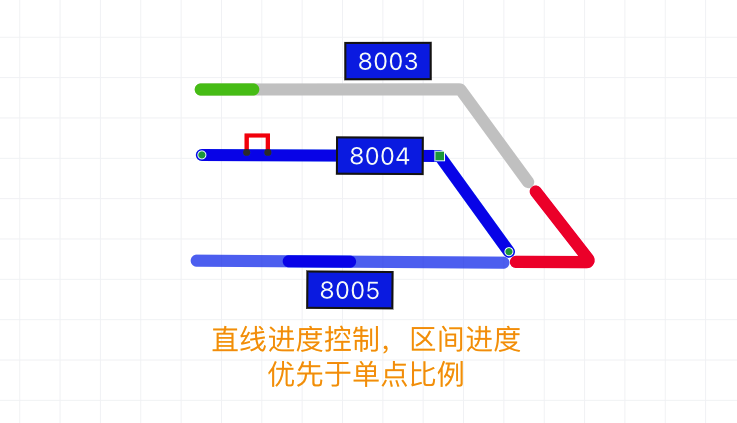

### 节点边框流动

涉及边框宽度、颜色、虚线样式、流动属性等。

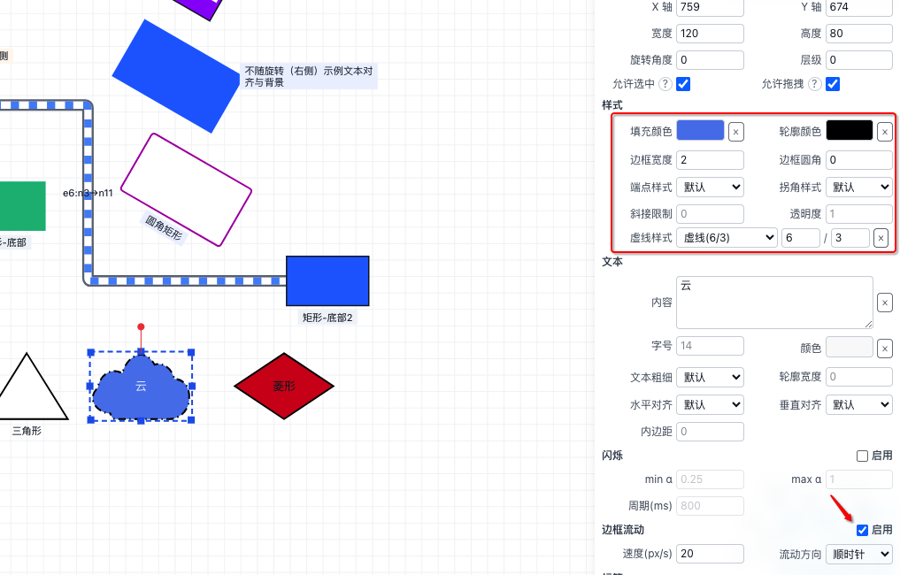

### 格式刷

:::warning
1. 针对同类元素进行样式格式化（节点->节点，边->边），注意源节点选择避开标签，若被格式化元素不支持源元素的样式将不会生效，但是style数据中依然会带有其数据，避免无脑格式化。
2. 目标节点时通过检测鼠标碰撞捕获的，如果点击了对应元素未被格式化，可以挪动点击位置（可能存在其他操作冗余距离导致，如：边或节点的锚点有冗余距离）。
:::

选中元素后点击开启，再次点击关闭，可以针对样式格式化，本质上是通过数据中style样式替换。

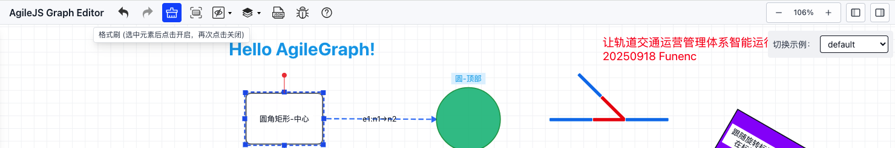

### AI

:::tip
AI模型的API Key仅存储于本地，不会外传，放心使用。
:::

#### 如何使用 AI 生成/调优画布
- 打开右上角 “AI” 面板，先确认系统提示词和业务约束是否符合当前场景（可在弹窗中查看/编辑）。
- 在输入框描述需求（越具体越好，如节点类型、连线方式、分组、布局方向、样式倾向）。
- 选择动作：
  - **生成画布**：覆盖当前画布并生成新的节点/边。
  - **追加生成**：在现有画布上追加生成内容。
  - **调优**：基于当前选中元素或全局进行微调（位置/尺寸/样式/文案）。
- 点击执行后等待生成，生成完成会自动落盘到画布中，可使用撤销/重做进行回溯。
- 如需再次迭代，可在相同对话上下文继续输入，让 AI 持续改进；满意后记得保存场景。
- AI系统提示参考提示词：[系统提示词](https://docs.cq-tct.com/agilejs/system-prompt.md)

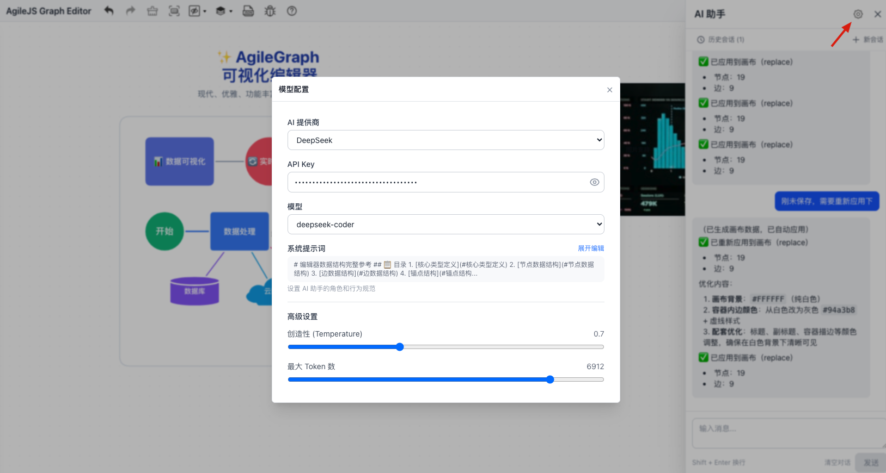

  

    
    
AI生成初稿效果

  

  

    
    
AI调优后效果

  

